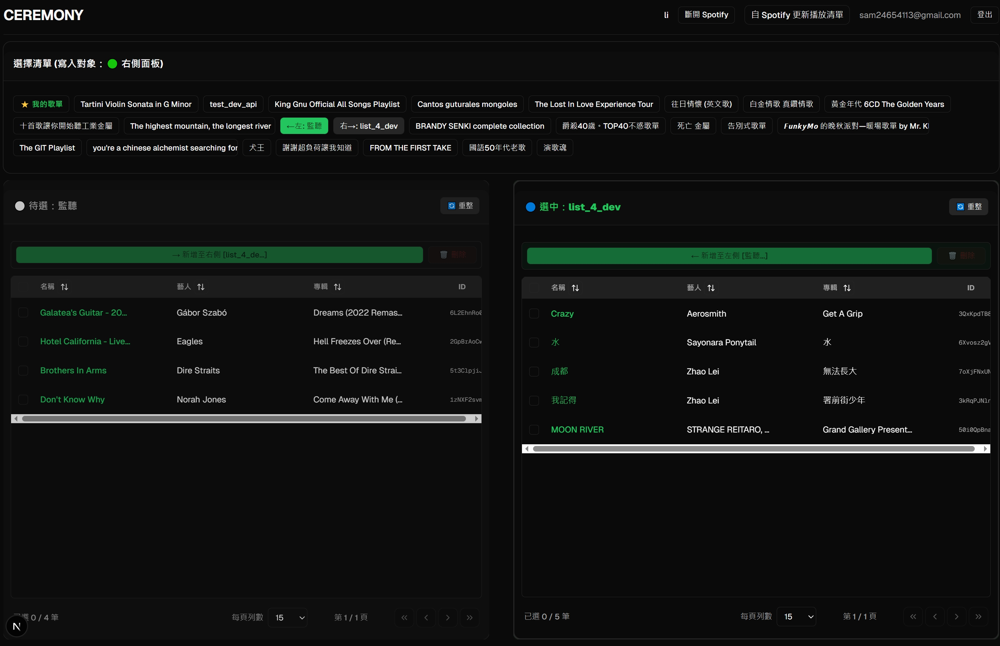
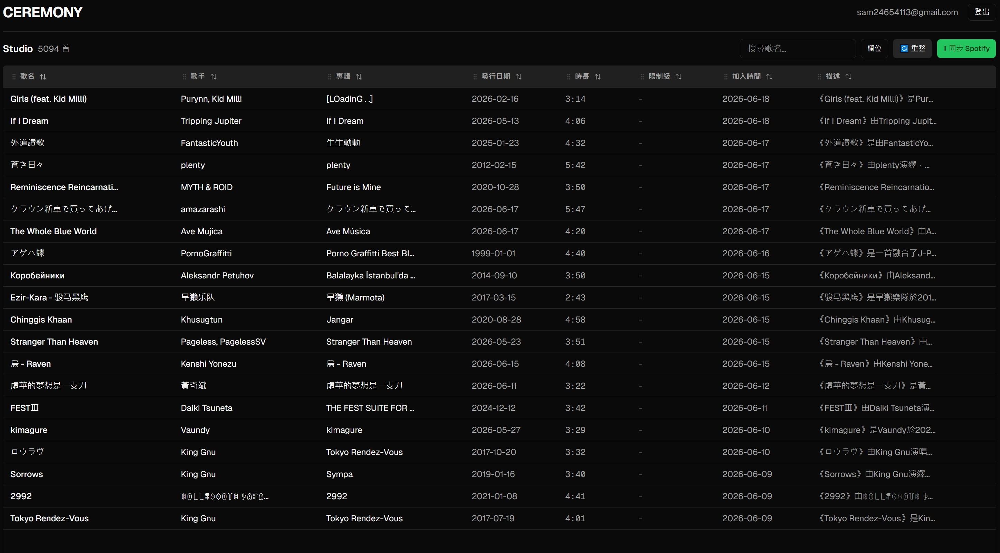
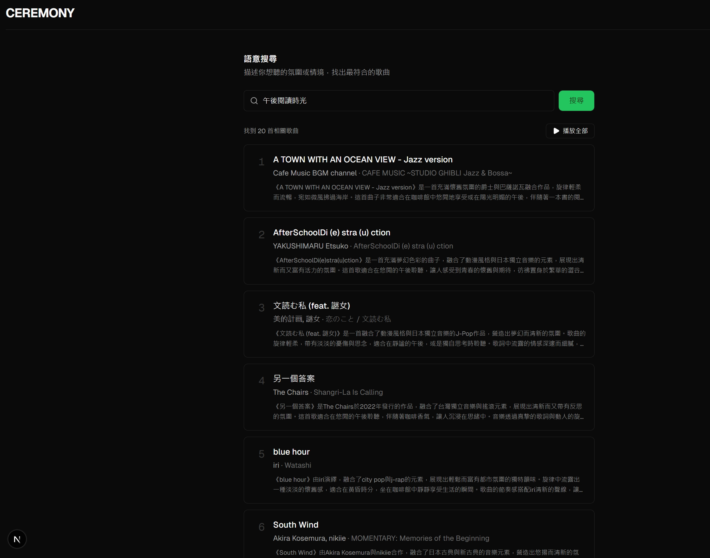

# 🎵 Spotify Tidy

> **個人化音樂情境播放系統，以 Spotify 作為播放軟體。**

---

## ✨ 核心功能

### 歌單整理
- **雙面板介面**：同時瀏覽兩張播放清單，多欄位搜尋，點擊聚焦切換
- **批次操作**：多選歌曲，跨歌單批量搬移、刪除，雙向操作



### Studio 後台
- **曲庫管理**：5,000+ 首歌曲全覽，支援欄位排序、顯示控制、拖拉換序、分頁



### 情境播放
- **語意搜尋播放**：輸入自然語言情境（如「午後閱讀時光」），搜尋出最相關曲目，一鍵播放或單首播放，並支援多裝置選擇



### AI Pipeline
- **風格描述生成**：使用 GPT-4o-mini 為每首曲目生成風格描述，並用 bge-m3 對每個敘述做 embedding
- **語意向量化**：對依照使用者輸入字串，向量搜尋最符合情境的曲目

---

## 🛠️ 使用技術

### Frontend
- **Framework**：Next.js 15
- **Language**：TypeScript
- **Styling**：Tailwind CSS v4 + shadcn/ui

### Backend
- **Framework**：FastAPI
- **資料庫**：PostgreSQL + pgvector
- **任務佇列**：Redis + ARQ
- **部署**：Docker Compose
- **代理**：nginx

### LLM / AI
- **描述生成**：OpenAI GPT-4o-mini
- **向量模型**：Ollama + bge-m3

---

## 🗺️ 服務架構

```
瀏覽器
  └── nginx（port 80）
        ├── /          → frontend（Next.js）
        ├── /auth      → auth service（JWT、Spotify OAuth）
        ├── /spotify   → spotify service（歌單、播放控制）
        └── /nlp       → nlp service（同步、AI pipeline、語意搜尋）
                              └── nlp-worker（ARQ 背景任務）
```
