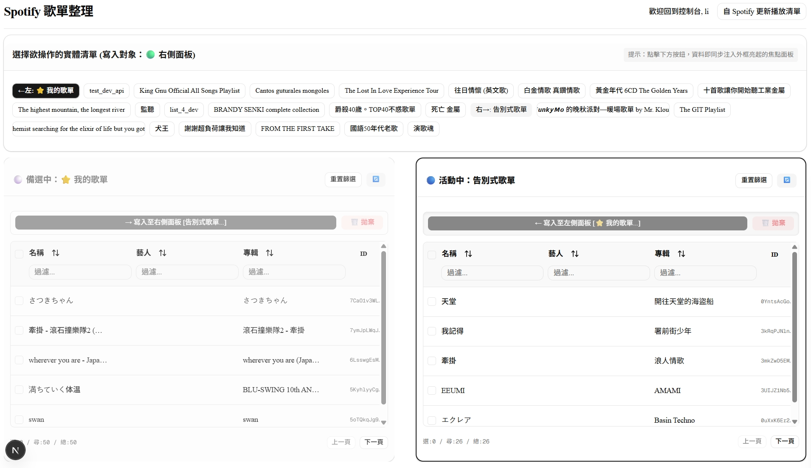

# 🎵 Spotify Tidy

> **Spotify playlist manager.**

官方的 Spotify 客戶端無法批量刪除與新增歌單，用起來不夠方便，因此 Spotify Tidy 誕生了。
---

## ✨ 核心功能 (Key Features)

- **雙向瀏覽 (Dual-Panel Interface)**：點擊左/右側面板聚焦，指定要讀取的歌單，提供多欄位搜尋功能。
- **批次操作 (Batch Operations)**：支援多選歌曲，並且雙向操作，不管是往左存還是往右刪，還是兩邊一起刪。

---

## 🛠️ 架構技術棧 (Tech Stack)

### Frontend
- **Framework**: Next.js 15 (App Router)
- **Language**: TypeScript
- **Styling**: Tailwind CSS v4 + shadcn/ui
- **Tables & State**: TanStack Table v8, React-Split

### Backend
- **Framework**: FastAPI (Python)
- **Spotify SDK**: Spotipy
- **Deployment**: Docker, Docker Compose

---

## 🚀 未來規劃 (Roadmap)

- [ ] **AI Agent 語意化操作 (Semantic AI)**：深度串接 AI Agent 模型，達成顛覆傳統介面的「語意化播放指令」與「智慧歌單微調」。
- [ ] **曲風分析視覺圖表 (Visual Analytics)**：將 Spotify 音軌特徵 (BPM、Danceability、Energy) 轉化為雷達圖或統計圖表，讓使用者能透過視覺化方式深度剖析自我音樂品味與歌單屬性。
- [ ] **智慧條件分類**：一鍵提供智慧建議，自動幫您將龐大的「我的歌單」硬性拆分為「運動」、「專注」、「派對」等多個實體子清單。

---

## 💻 本地與虛擬機部署指南 (Deployment Guide)

### 1. 準備機密金鑰
本系統的登入與讀取完全依賴官方 API。請先至 [Spotify Developer Dashboard](https://developer.spotify.com/dashboard) 申請您的自有應用程式，並將 `Redirect URI` 白名單設為 `http://127.0.0.1:8000/callback`。

接著在專案目錄下的 `deploy` 中建立 `.env.dev` 檔案：
```env
SPOTIPY_CLIENT_ID=填入您的ClientID
SPOTIPY_CLIENT_SECRET=填入您的ClientSecret
SPOTIPY_REDIRECT_URI=http://127.0.0.1:8000/callback
```

### 2. 啟動 Container (Linux VM 環境)
進入 `deploy` 資料夾，即可一鍵讀取環境變數並拉起前後端架構：
```bash
cd deploy
sudo docker-compose -f compose.dev.yml up -d
sudo docker-compose -f compose.dev.yml up -d --build
```

### 3. OAuth 安全驗證解法 (本機 SSH 隧道)
由於 Spotify 官方極度嚴謹的資安規定，第三方登入唯一的非 HTTPS 豁免網段為 `localhost` 與 `127.0.0.1`。
若您的 Docker 是部署在遠端虛擬機，請勿直接以區網 IP 在瀏覽器中進入系統。

在您本地操作的電腦 (Windows) 上，請打開 PowerShell 執行以下 SSH 隧道指令：

```powershell
ssh -L 3000:127.0.0.1:3000 -L 8000:127.0.0.1:8000 user@[ip_address]
```
*(若未來虛擬機 IP 有變更，請自行替換最後方的 IP)*

此行指令會打通安全蟲洞，將您本機的 `3000` (Next.js) 與 `8000` (FastAPI) 連線全部無縫代理給遠端虛擬機。
連線完成後，請在瀏覽器網址列直接打開安全白名單：

👉 **`http://localhost:3000`**

即可順利進入 Spotify Tidy 整理您的音樂！

